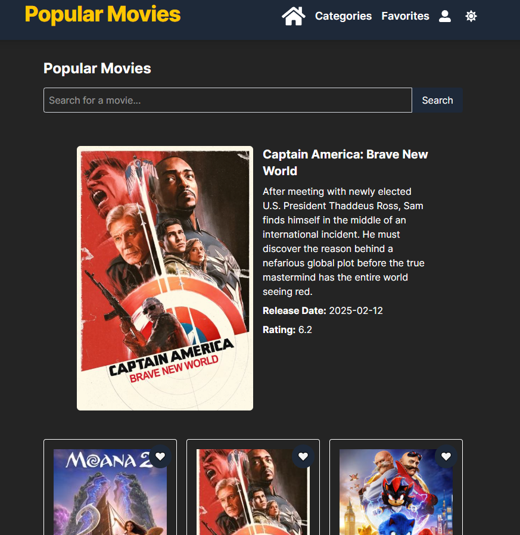

# React + TypeScript + Vite

# Explorador de Películas

Este proyecto es una aplicación web que permite a los usuarios explorar películas populares, buscar películas por título, filtrar por género, ver detalles de películas y guardar películas favoritas. La aplicación utiliza The Movie Database (TMDb) API para obtener datos de películas y gestiona el estado con Redux Toolkit. Además, incluye un modo oscuro y guarda las películas favoritas en el localStorage.

## Características Principales

- **Listado de Películas Populares**: Muestra una lista de películas populares con su título, imagen de portada, calificación y fecha de lanzamiento.
- **Búsqueda de Películas**: Permite a los usuarios buscar películas por título.
- **Filtrado por Género**: Filtra películas por género.
- **Detalles de Películas**: Muestra detalles completos de una película, como sinopsis, actores principales, duración y puntuación.
- **Películas Favoritas**: Los usuarios pueden marcar películas como favoritas y verlas en una página dedicada.
- **Modo Oscuro**: Incluye un modo oscuro para una mejor experiencia visual.
- **Infinite Scroll**: Carga más películas automáticamente al desplazarse hacia abajo.
- **Persistencia de Favoritos**: Las películas favoritas se guardan en el localStorage y persisten después de recargar la página.

## Tecnologías Utilizadas

- **React**: Biblioteca de JavaScript para construir la interfaz de usuario.
- **Redux Toolkit**: Para la gestión del estado global de la aplicación.
- **Redux Toolkit Query (RTK Query)**: Para manejar las llamadas a la API de TMDb.
- **TailwindCSS**: Framework de CSS para estilizar la aplicación.
- **React Router**: Para la navegación entre páginas.
- **TypeScript**: Para agregar tipos estáticos a JavaScript.
- **LocalStorage**: Para guardar las películas favoritas.

## Requisitos Previos

Antes de comenzar, asegúrate de tener instalado:

- Node.js (v16 o superior)
- npm o Yarn

## Instalación y Configuración

Sigue estos pasos para instalar y ejecutar el proyecto en tu máquina local.

1. **Clonar el Repositorio**  
   Clona el repositorio en tu máquina local:

   ```bash
   git clone https://github.com/tu-usuario/explorador-peliculas.git
   cd explorador-peliculas
2. **Instalar Dependencias** 

Instala las dependencias del proyecto usando npm o Yarn:
```
npm install
# o
yarn install
```

3. **Configurar la API Key de TMDb**
Regístrate en The Movie Database (TMDb) y obtén una API Key.

Crea un archivo .env en la raíz del proyecto y agrega tu API Key:

```
REACT_APP_TMDB_API_KEY=tu_api_key_aquí
```
4. **Ejecutar el Proyecto**
Inicia el servidor de desarrollo:

```
npm start
# o
yarn start
```

La aplicación estará disponible en http://localhost:3000.


**Funcionalidades Detalladas**

*Listado de Películas Populares*
Muestra una lista de películas populares al cargar la página.
Usa RTK Query para obtener los datos de la API de TMDb.

*Búsqueda de Películas*
Permite a los usuarios buscar películas por título.
Muestra los resultados de búsqueda en tiempo real.

*Filtrado por Género*
Filtra películas por género utilizando la API de TMDb.

*Detalles de Películas*
Muestra detalles completos de una película al hacer clic en ella.

*Películas Favoritas*
Los usuarios pueden marcar películas como favoritas.
Las películas favoritas se guardan en el localStorage.

*Modo Oscuro*
Incluye un botón para cambiar entre modo claro y oscuro.
El tema seleccionado se guarda en el localStorage.

*Infinite Scroll*
Carga más películas automáticamente al desplazarse hacia abajo.